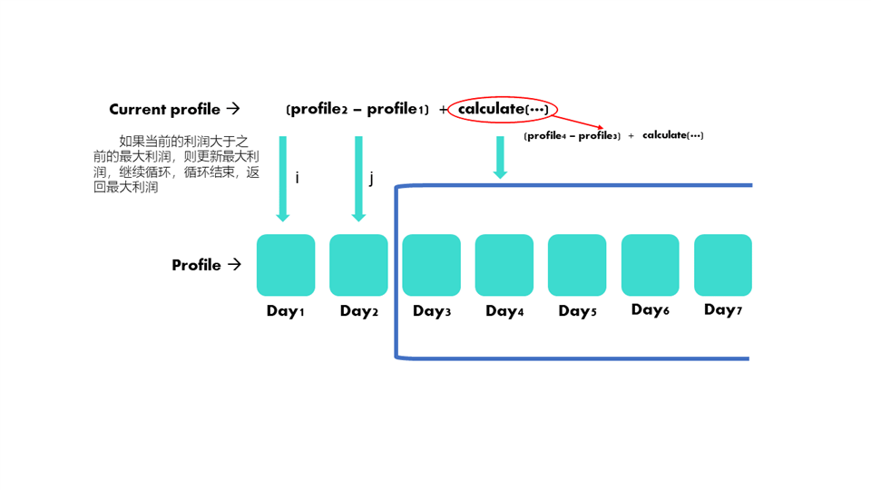

*关于这个问题的初始版本我已经在代码里写的比较详细了，但是它的变形确实比它难了一些，我在这里记录一下*
### 方法一
首先是暴力求解，面对这种情况我们就要选择[递归](https://blog.csdn.net/u011514810/article/details/52749183)了，当我们从第一个位置开始遍历时，我们需要做的是啥？比如下面这个图，我们的总利润是当前位置与之前最小利润之间的差值加上这个结点后面所有结点的最大利润，而后面这些结点的最大利润的的计算，则和之前所介绍的一模一样。 那么这是啥？这不就是递归嘛😀。 

递归就是一层一层地调用一个函数，我们设这个函数为calculate(···)，那么我们需要啥参数呢?  

还是看这个图，我们递归需要一个数组，那么首先确定**calculate(int[] prices, ···)** ，很显然，每次递归我们需要的是一个子数组，就比如我下面用蓝色框标注的那样，但是Java在切片方面的封装不太好，那我们怎么办，我们可以每次再传一个参数，就是这个子数组的起始点在母数组的下标找出来。那么函数可初步确定为**calculate(int[] prices, int position)**，到目前为止，我们的小脑袋也就能想这么多了，开始写具体逻辑




```java
class Solution {
    public int maxProfit(int[] prices) {
        return calculate(prices, 0);
    }

    public int calculate(int[] prices, int position) {
        //首先我们要判断是不是数组越界，如果越界，此递归结束
        //此时蓝框框内没有元素，那么篮框框内的利润为零
        if (position >= prices.length) {
            return 0;
        }

        //到这里我就想了，我要获得最大的利润，我得有个值去记录
        //它呀
        int max = 0;

        //接下来我们就要开始循环，从第一个开始，然后接着它二重循环
        for (int i = position; i < prices.length; i++) {
            //在二重遍历里面，我们想要获得的是啥?
            //正如上图，
            //1.我们需要知道j与i指针之间的利润profile1
            //2.需要知道后面蓝框框里的最大利润值profile2
            for(int j = position + 1; j < prices.length; j++) {
                int temp = 0;
                if (prices[j] > prices[i]) {
                    temp = (prices[j] - prices[j]) + calculate(prices, j + 1);
                }
                if(temp > max) {
                    max = temp;
                }
            }
        }

        return max;

    }

}
```