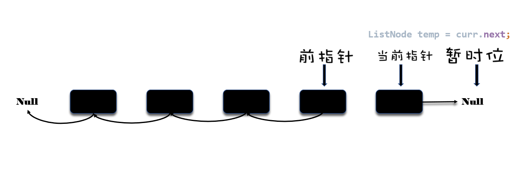

# Leetcode小解析-24.反转链表
## 方法一，简单粗暴

<font size = 1>第一次做动图，不太好看，多担待</font>  

如上图，这里使用的方式也是leetcode上的第一赞的解析，利用两个指针，一个暂时位置来引导两个指针向后移动。  

### 1.1 思想

这个思想就是，用一个 `pre` 指针和一个 `cur` 指针，顾名思义，`curr` 从头开始，指向每个当前的结点，`pre` 就是 `cur` 的前一个结点。所谓反转，就是要让每个结点指向其前一个结点。每次移动，我们用 `cur`记录当下的node，用 `pre` 记录前一个node，然后让 `cur.next = pre`

### 1.2 细节
大体思想是这样的，那么要考虑细节：
+ 指针后移的方式是啥?
+ 移动停止的条件是啥？
+ 返回啥？

那么我们来看第一点，从链表的形式来看，链表是一个天生的迭代型的数据结构，也就是类似于for循环或者while循环。又因为链表无法获得总数量（在链表头处），那么我们采用while循环来遍历链表。

第二点，停止方式？遍历完就可以了，但是我们在写完具体代码之前没法确到底是什么条件算完，那我们先用 `T` 来表示这个条件。

现在我们的代码就可以有个框架了
```java
public ListNode reverseList(ListNode node) {
        ListNode curr = node;
        ListNode pre = null;
        //T是某种条件
        while(T) {
            //todo:
            curr.next = pre
            //todo:
        }
        return ?;
    }

```
#### temp指针的作用

到现在我们来看，我们光让`cur.next = pre`了，现在的结果是这样的:


接下来我们要做的是，让指针后移，`pre = curr`，让前指针往后移动一位。


那么到现在，假设没有temp指针，也就是暂时位，我们该如何把curr指针移动到下一位呢？No Way!

大家看到这个地方，估计也就了解 `temp` 的作用了。

那么这个整个后移的流程是：
```java
public ListNode reverseList(ListNode node) {
        ListNode curr = node;
        ListNode pre = null;
        //T是某种条件
        while(T) {
            temp = curr.next //temp记录当前指针的下一位
            curr.next = pre //将下一位指向前一个node
            pre = curr //前指针后移
            curr = temp //当前指针后移
        }
        return ?;
    }
```

#### 循环结束的条件

那么让我们继续讨论循环结束的条件。根据我们的大体思路，`curr` 是一路从头移动到尾的，到这种情况下，循环还是不能够结束，因为这个位置上我们依旧要让 `curr` 执行上面的内容。




到上图这个状态，我们就可以说，循环结束了。  
如何确定while停止循环的状态？我们要找到一个量，前几张图与倒数第一张图中的这个量会发生突变。记住，**一定是要之前的都是这个量，但是到结束状态就突变了**  
`pre` ？貌似不太行；`temp`？感觉也不行，因为倒数第二张，也就是上次循环之前它就变成了null了；`curr`?对，只有curr之前都是非null的，循环结束，到结束状态的时候，它变成null了，换句话说，`curr`变成了null，循环就该结束了。

更新我们的代码：
```java
public ListNode reverseList(ListNode node) {
        ListNode curr = node;
        ListNode pre = null;
        //T是某种条件
        while(curr != null) {
            temp = curr.next //temp记录当前指针的下一位
            curr.next = pre //将下一位指向前一个node
            pre = curr //前指针后移
            curr = temp //当前指针后移
        }
        return ?;
    }
```

#### 最后，我们要返回啥？
还是看最终状态的图，哪个指针指向反转后的链表的表头？`pre`，对，我们返回`pre`'

#### 最终的代码

```java
public ListNode reverseList(ListNode node) {
        ListNode curr = node;
        ListNode pre = null;
        //T是某种条件
        while(curr != null) {
            temp = curr.next //temp记录当前指针的下一位
            curr.next = pre //将下一位指向前一个node
            pre = curr //前指针后移
            curr = temp //当前指针后移
        }
        return pre;
    }
```

## 方法二，用栈，老实人的方法


懒人落泪，先看看代码吧
```java
 public ListNode reverseList(ListNode node) {
        if(node == null) {
            return null;
        }
       Stack<ListNode> stack =  new Stack<>();
        while(node != null) {
            ListNode temp = node;
            stack.push(temp);
            node = node.next;
        }
        ListNode head = stack.peek();
        while (!stack.isEmpty()) {
            ListNode temp1 = stack.pop();
            ListNode temp2 = stack.isEmpty() ? null : stack.peek();
            temp1.next = temp2;
            if (!(temp2 == null)) {
                temp2.next = null;
            }
        }
        return head;
    }
```

这个是我自己想出来的，代码的思想其实就是利用栈先进后出的原理，把这些node逆序排起来，然后一个一个拿出来，连起来，这其中还有一丢丢的java引用的思想，动图和代码都在这了，各位看官稍微看看，因为这个比较耗时，2ms，大家就当看个乐吧。


懒人落泪，就先弄这么多吧。
