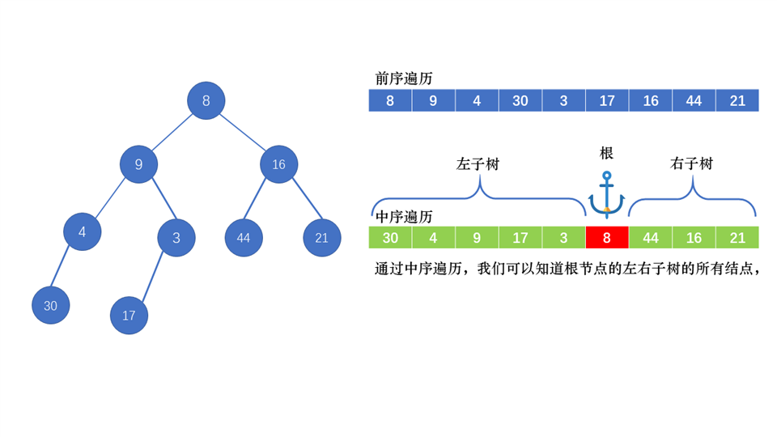
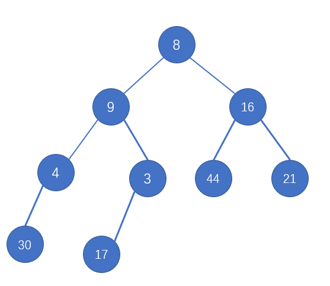
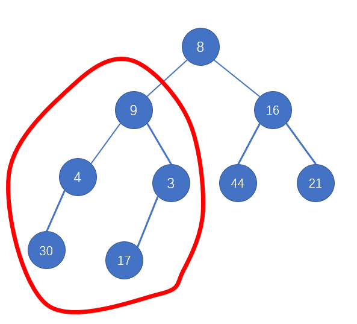
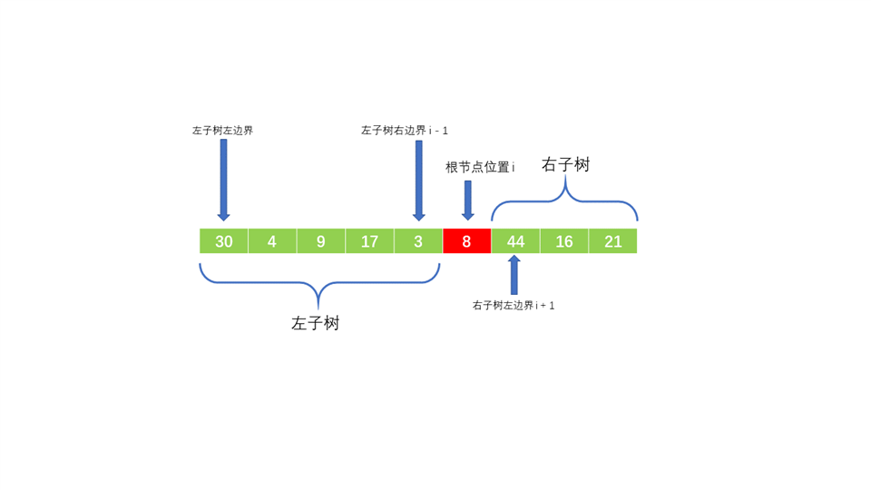
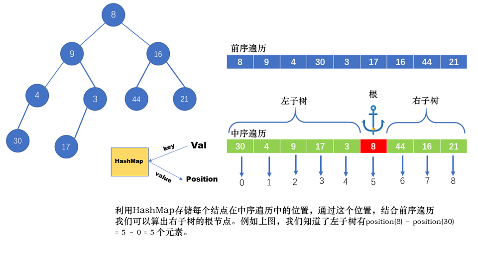
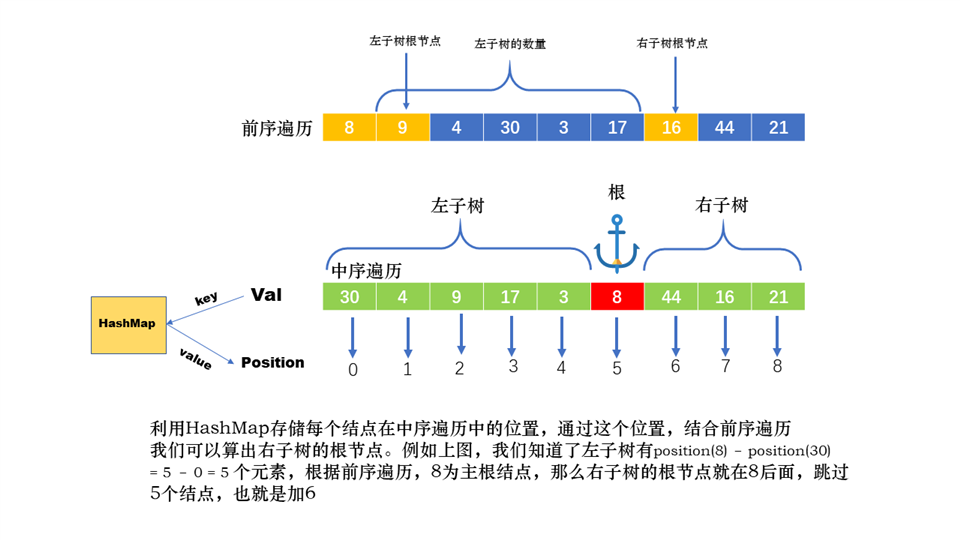

# 面试题07. 重建二叉树
>输入某二叉树的前序遍历和中序遍历的结果，请重建该二叉树。假设输入的前序遍历和中序遍历的结果中都不含重复的数字。

 

>例如，给出

>前序遍历 preorder = [3,9,20,15,7]  
>中序遍历 inorder = [9,3,15,20,7]  
返回如下的二叉树：
```
    3
   / \
  9  20
    /  \
   15   7
```

>限制：
0 <= 节点个数 <= 5000



---

如上图，我们通过前序遍历以及中序遍历确定了整个树的根节点，通过中序遍历，我们可以把树分成左右两个子树。我们接下来需要做的是**递归，用相同的方法找到左右两个子树的根节点**，一遍一遍套娃。

接下来有几个问题出现了
1. 如何确定停止条件？
2. 如何确定根节点？

## 如何确定停止条件
我们要确立一个思想，就是前序遍历的结果用来在算法中进行真正的遍历，换句话说，我们构建子树，每个结点中的值是通过前序遍历获得的，因为前序遍历有其独特的优势————**每次顺序遍历下去，每个结点（除叶结点）都是一棵子树的根节点**，这样，比如刚从8这个结点开始递归，根节点在前序遍历的位置pre_position = 0，那么其左子树的根节点（其实就是左孩子）在前序遍历的位置就为pre_position + 1，这些当然都是下一部分需要说的。


回到正题，如何确定停止条件？我们再确定一下我们的思路：找到根节点，找到它的左孩子（左子树的根节点），找到右孩子（其右子树的根节点），根节点我们找到了，然后要到左子树里找其根节点，**对，左子树，首先要有左子树，我们就得有这个子树的范围，** 通过中序遍历我们可以知道，比如
```
   A
  / \
 B   C 
```
这样一棵子树，其中序遍历的结果为BAC，**左端和右端分别为该棵子树的左右边界，** 最极端的情况比如只有一个结点，我们也可得到一个 **“左边界等于右边界”** 的结论，那么当当前结点的左边界大于右边界时，我们可以认为，当前结点为空，可以返回空值，停止套娃。

那么现在问题就变成了
## 如何获得左右边界？

我们写一个伪代码：
```java

public TreeNode toBuild(int root_pre, int left, int right) {
    //当左边界大于右边界的时候，返回空值
    if(left > right) {
        return null;
    }
    //从前序遍历数组中找到根节点
    node = Node(getNodeValInPreOrder(root_pre))
    //root_pre+1的来历上面已经说了，那么左右边界是啥？
    node.left = toBuild(root_pre + 1, 左边界1，右边界1);
    node.right = toBuild(右子树根节点，左边界2，右边界2);
}


```
 


### 左子树的左边界

我们看到，以8为根的整棵树的左边界为30（所在的位置），以其左孩子9为根节点的子树的左边界为30（所在的位置），以此类推，我们得出一个结论——**结点的左子树的左边界与该结点一致**

### 左子树的右边界


### 右子树的左边界
同上图

### 右子树的右边界
跟左子树的左边界一个道理

那么更新我们的伪代码

```java

public TreeNode toBuild(int root_pre, int left, int right) {
    //当左边界大于右边界的时候，返回空值
    if(left > right) {
        return null;
    }
    //从前序遍历数组中找到根节点
    node = Node(getNodeValInPreOrder(root_pre));
    //获得根节点在中序遍历中的位置
    i = getPositonInMiddleOrder(getNodeValInPreOrder(root_pre));
    node.left = toBuild(root_pre + 1, left，i - 1);
    node.right = toBuild(右子树根节点，i + 1，right);
}


```


## 如何确定根节点?

其实现在只差一个右子树的根节点了，我先上图




由图可以轻易知道，右子树的根节点为当前的结点位置（前序）+ 当前结点的左子树的数量 + 1
```java

public TreeNode toBuild(int root_pre, int left, int right) {
   
    if(left > right) {
        return null;
    }
   
    node = Node(getNodeValInPreOrder(root_pre));
    
    i = getPositonInMiddleOrder(getNodeValInPreOrder(root_pre));
    node.left = toBuild(root_pre + 1, left，i - 1);
    //root_pre: 当前结点的位置
    //i - left: 左子树的数量
    //最后+1，到达右子树根结点
    node.right = toBuild(root_pre + (i - left) + 1，i + 1，right);
}


```

## 完整代码

```java
private HashMap<Integer, Integer> map = new HashMap<>();
    private int[] pre;

    public TreeNode buildTree(int[] preorder, int[] inorder) {
        for (int position = 0; position < inorder.length; position++) {
            map.put(inorder[position], position);
        }
        pre = preorder;
        return helper(0, 0, preorder.length - 1);
    }

    public TreeNode helper(int root, int left, int right) {
        if (left > right) {
            return null;
        }
        TreeNode node = new TreeNode(pre[root]);
        int i = map.get(pre[root]);
        node.left = helper(root + 1, left, i - 1);
        //i - left + 1该根结点的左子树的个数
        node.right = helper(root + i - left + 1, i + 1, right);
        return node;
    }
```
