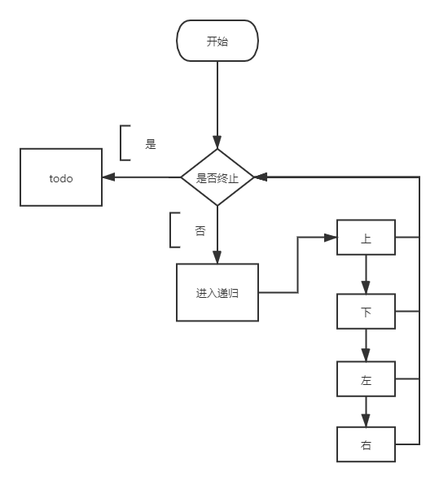
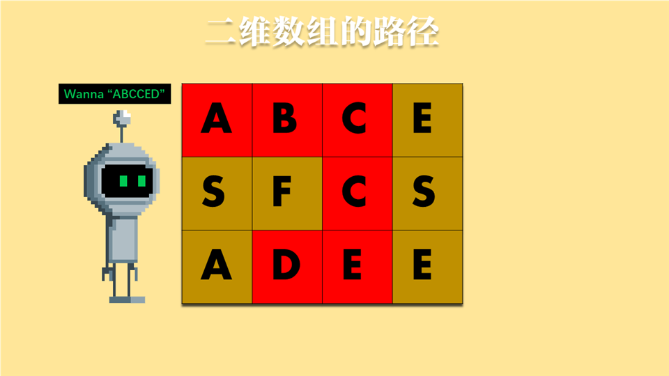
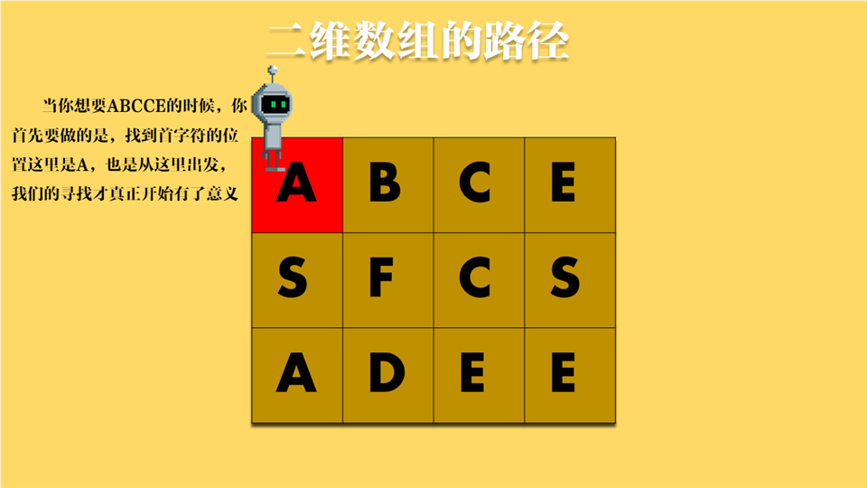
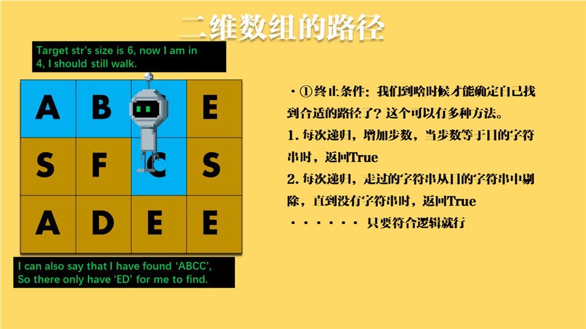
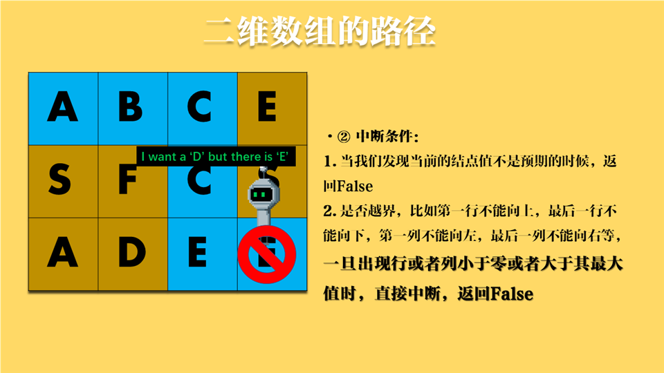
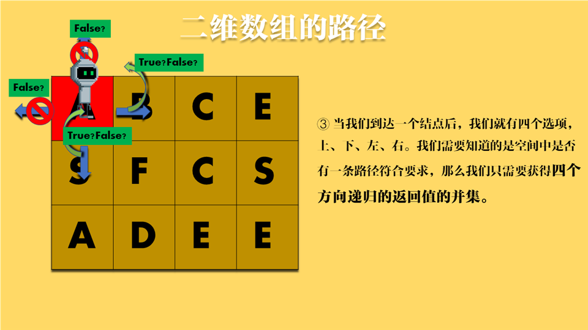
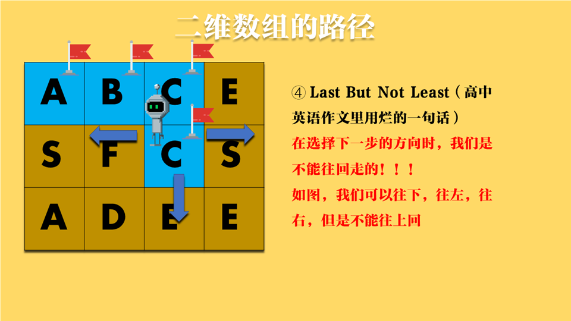
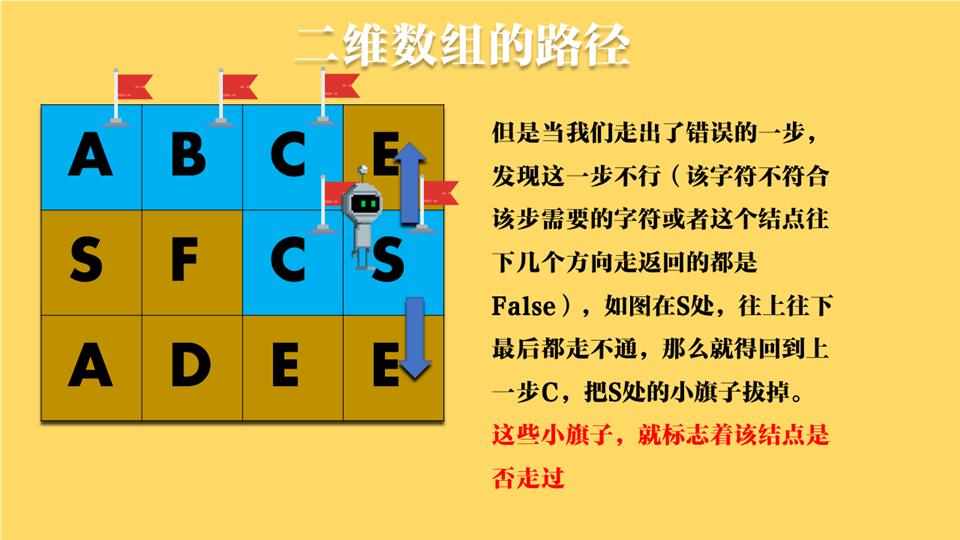
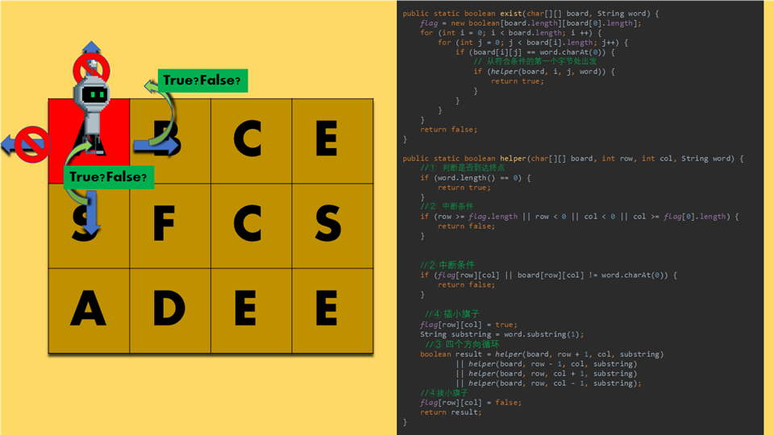

# 剑指offer的小解析—面试题12、13：关于二维数组的路径（上）   

## 首先看题
>面试题12. 矩阵中的路径

>请设计一个函数，用来判断在一个矩阵中是否存在一条包含某字符串所有字符的路径。路径可以从矩阵中的任意一格开始，每一步可以在矩阵中向左、右、上、下移动一格。如果一条路径经过了矩阵的某一格，那么该路径不能再次进入该格子。例如，在下面的3×4的矩阵中包含一条字符串“bfce”的路径（路径中的字母用加粗标出）。

```
[["a","b","c","e"],
["s","f","c","s"],
["a","d","e","e"]]
```
> 但矩阵中不包含字符串“abfb”的路径，因为字符串的第一个字符b占据了矩阵中的第一行第二个格子之后，路径不能再次进入这个格子。
 
---

>面试题13. 机器人的运动范围

>地上有一个m行n列的方格，从坐标 [0,0] 到坐标 [m-1,n-1] 。一个机器人从坐标 [0, 0] 的格子开始移动，它每次可以向左、右、上、下移动一格（不能移动到方格外），也不能进入行坐标和列坐标的数位之和大于k的格子。例如，当k为18时，机器人能够进入方格 [35, 37] ，因为3+5+3+7=18。但它不能进入方格 [35, 38]，因为3+5+3+8=19。请问该机器人能够到达多少个格子？

## 分析
这两道题都有几个相同的属性——**二维数组，一次一步，上下左右，以及终止条件。**
解决这种问题的思想就是：
+ 从初始结点开始
+ 分别向上下左右递归
+ 遇到终止条件，返回 



这些都是主体框架，接下来我们就要添加枝叶：
+ 是否需要记录遍历过的点
+ 如果记录遍历过的点
+ 是否需要取消记录
+ 如何确定终止条件


## 12题自制ppt










```java
package coding_interviews;

import java.util.HashMap;

/**
 * 面试题12. 矩阵中的路径
 * 请设计一个函数，用来判断在一个矩阵中是否存在一条包含某字符串所有字符的路径。路径可以从矩阵中的任意一格开始，每一步可以在矩阵中向左、右、上、下移动一格。如果一条路径经过了矩阵的某一格，那么该路径不能再次进入该格子。例如，在下面的3×4的矩阵中包含一条字符串“bfce”的路径（路径中的字母用加粗标出）。
 *
 * [["a","b","c","e"],
 * ["s","f","c","s"],
 * ["a","d","e","e"]]
 *
 * 但矩阵中不包含字符串“abfb”的路径，因为字符串的第一个字符b占据了矩阵中的第一行第二个格子之后，路径不能再次进入这个格子。
 *
 *
 *
 * 示例 1：
 *
 * 输入：board = [["A","B","C","E"],["S","F","C","S"],["A","D","E","E"]], word = "ABCCED"
 * 输出：true
 * 示例 2：
 *
 * 输入：board = [["a","b"],["c","d"]], word = "abcd"
 * 输出：false
 */
public class Interview_12 {
    public static final int UP = 0;
    public static final int DOWN = 1;
    public static final int LEFT = 2;
    public static final int RIGHT = 3;
    public static final int NONE = -1;
    public static HashMap<String, Integer> map = new HashMap<>();

    public static boolean[][] flag;
    public static void main(String[] args) {
//        char[][] test = {{'A','B','C','E'},{'S','F','C','S'},{'A','D','E','E'}};
//        String target = "ABCCED";
        char[][] test = {{'A'}};
        String target = "A";
        System.out.println(exist4(test, target));
    }

    /**
     * 终于，经过一次又一次的更改，我超时了，🐎🥚，我🍐⛰大
     * @param board
     * @param word
     * @return
     */
    public static boolean exist(char[][] board, String word) {
        boolean result = false;
        if (board.length * board[0].length < word.length()) {
            return false;
        }
        for (int i = 0; i < board.length; i++) {
            for (int j = 0; j < board[i].length; j++) {
                if (board[i][j] == word.charAt(0)) {

                    result = result || helper(board, i, j, word.substring(1), UP, true)
                            || helper(board, i, j, word.substring(1), DOWN, true)
                            || helper(board, i, j, word.substring(1), LEFT, true)
                            || helper(board, i, j, word.substring(1), RIGHT, true);
                    if (result) {
                        return true;
                    }
                }
            }
        }
        return false;
    }
    public static boolean helper(char[][] board, int row, int col, String word, int to, boolean isFirst) {
        if (isFirst) {
            map.clear();
            map.put(row + String.valueOf(col), 1);
        }
        if (word.length() == 0) {
            return true;
        }

        if ((row == 0 && to == UP)
                || (row == board.length - 1 && to == DOWN)
                || row == board.length && col == board[0].length
                || (col == 0 && to == LEFT)
                || (col == board[0].length - 1 && to == RIGHT)) {

            return false;
        }

        boolean result = false;
        switch (to) {
            case UP:
                result = board[--row][col] == word.charAt(0);
                break;
            case DOWN:
                result = board[++row][col] == word.charAt(0);
                break;
            case LEFT:
                result = board[row][--col] == word.charAt(0);
                break;
            case RIGHT:
                result = board[row][++col] == word.charAt(0);
                break;
            default:
                throw new IllegalStateException("Unexpected value: " + to);
        }
        if (!result) {
            return false;
        }
        if(map.containsKey(row + String.valueOf(col))) {
            return false;
        } else {
            map.put(row + String.valueOf(col), 1);
        }

        String newWord = word.substring(1);
        boolean result2 = (to != DOWN && helper(board, row, col, newWord, UP, false))
                || (to != UP && helper(board, row, col, newWord, DOWN, false))
                || (to != RIGHT && helper(board, row, col, newWord, LEFT, false))
                || (to != LEFT && helper(board, row, col, newWord, RIGHT, false));
        if(!result2) {
            map.remove(row + String.valueOf(col));
        }

        return result2;
    }


    /**
     * 超时，就使劲超时
     * @param board
     * @param word
     * @return
     */
    public static boolean exist2(char[][] board, String word) {
        if (board.length * board[0].length < word.length()) {
            return false;
        }
        for (int i = 0; i < board.length; i++) {
            for (int j = 0; j < board[i].length; j++) {
                if (board[i][j] == word.charAt(0)) {
                    if (helper2(board, i, j, word)) {
                        return true;
                    }
                }
            }
        }
        return false;
    }

    public static boolean helper2(char[][] board, int row, int col, String word) {
        String key = row + String.valueOf(col);
        if (map.containsKey(key)) {
            return false;
        }
        if (word.length() == 0) {
            return true;
        }
        if (row < 0 || row > board.length - 1) {
            return false;
        }
        if (col < 0 || col > board[row].length - 1) {
            return false;
        }
        if (board[row][col] != word.charAt(0)) {
            return false;
        }
        String newStr = word.substring(1);
        map.put(key, 1);
        boolean result =  helper2(board, row + 1, col, newStr)
                || helper2(board, row - 1, col, newStr)
                || helper2(board, row, col + 1, newStr)
                || helper2(board, row, col - 1, newStr);
        map.remove(key);
        return result;
    }


    /**
     * 过，就硬过呗
     * @param board
     * @param word
     * @return
     */
    public boolean exist3(char[][] board, String word) {

        for (int i = 0; i < board.length; i++) {
            for (int j = 0; j < board[i].length; j++) {
                if (board[i][j] == word.charAt(0)) {
                    if (helper3(board, i, j, word, NONE)) {
                        return true;
                    }
                }
            }
        }
        return false;
    }

    public boolean helper3(char[][] board, int row, int col, String word, int to) {
        String key = row + String.valueOf(col);
        // if (map.containsKey(key)) {
        //     return false;
        // }
        if (word.length() == 0) {
            return true;
        }
        if (row < 0
                || row > board.length - 1
                || col < 0 || col > board[row].length - 1
                || board[row][col] != word.charAt(0)) {
            return false;
        }
        // if (col < 0 || col > board[row].length - 1) {
        //     return false;
        // }
        // if (board[row][col] != word.charAt(0)) {
        //     return false;
        // }
        char temp = board[row][col];
        String newStr = word.substring(1);
        // map.put(key, 1);
        board[row][col] = '/';
        boolean result = (to != UP && helper3(board, row + 1, col, newStr, DOWN))
                || (to != DOWN && helper3(board, row - 1, col, newStr, UP))
                || (to != LEFT && helper3(board, row, col + 1, newStr, RIGHT))
                || (to != RIGHT && helper3(board, row, col - 1, newStr, LEFT));
        // map.remove(key);
        board[row][col] = temp;
        return result;
    }

    public static boolean exist4(char[][] board, String word) {
        flag = new boolean[board.length][board[0].length];
        for (int i = 0; i < board.length; i ++) {
            for (int j = 0; j < board[i].length; j++) {
                if (board[i][j] == word.charAt(0)) {
                    if (helper4(board, i, j, word)) {
                        return true;
                    }
                }
            }
        }
        return false;
    }

    public static boolean helper4(char[][] board, int row, int col, String word) {
        if (word.length() == 0) {
            return true;
        }

        if (row >= flag.length || row < 0 || col < 0 || col >= flag[0].length) {
            return false;
        }


        if (flag[row][col] || board[row][col] != word.charAt(0)) {
            return false;
        }

        flag[row][col] = true;
        String substring = word.substring(1);
        boolean result = helper4(board, row + 1, col, substring)
                || helper4(board, row - 1, col, substring)
                || helper4(board, row, col + 1, substring)
                || helper4(board, row, col - 1, substring);
        flag[row][col] = false;
        return result;
    }


}

```